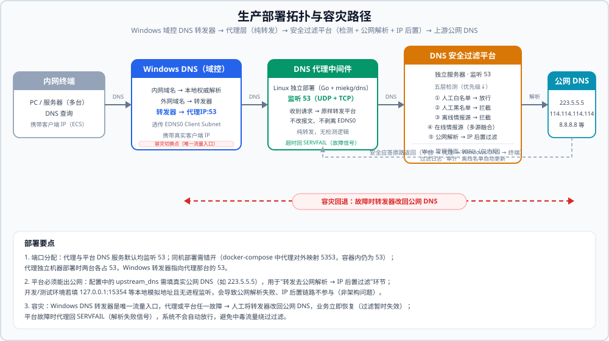

# Windows DNS 安全过滤中间件 开发 PRD（V2.1）

> 本文档基于《Windows DNS 安全过滤中间件 需求说明书（完整版 V2.2）》（合并 V1.1~V2.2 全部 21 轮迭代需求）编写，
> 面向开发实现，定义数据模型、接口、配置项与技术方案。V2.0 之后新增内容以「★」标注（V1.2~V2.0 的「▲」保留）。
> 本 PRD 描述的即系统**当前已实现并验证的规格基线**（265 项测试全绿），可用于二次开发、部署与验收。

## 一、文档说明

| 项 | 内容 |
|----|------|
| 项目 | Windows DNS 安全过滤中间件 |
| 目标读者 | AI 开发助手 / 开发工程师 |
| 关联文档 | 《Windows DNS 安全过滤中间件 需求说明书（完整版 V2.2）》、《生产环境部署方案（Linux 双机）》 |
| 环境 | 纯 IPv4 内网；Windows Server 原生 DNS；网络不支持 IPv6（但客户端可能发起 AAAA 查询，需同等过滤） |
| 部署原则 | 代理中间件独立部署，Windows DNS 零安装、仅配转发器；代理与平台均以 **Linux 部署为准**——systemd 原生与 **Docker（推荐）** 两种方式，Windows 部署仅作备用 |

## 二、系统架构

### 1. 组件与职责

| 组件 | 部署 | 职责 |
|------|------|------|
| Windows DNS | 既有（可多台） | 内网解析照常；仅新增一条转发器，将外网域名转发至代理中间件；转发时透传 EDNS0 Client Subnet（RFC 7871）携带客户端 IP |
| DNS 代理中间件 | 独立部署（与 Windows DNS 不同机，可多个） | 监听 53 端口接收 Windows DNS 转发的查询，**原样透传（含 EDNS0 选项）**至安全过滤平台，回传应答 |
| DNS 安全过滤平台 | 独立服务器（单实例） | 作为 DNS 服务器接收查询 → 提取客户端 IP → 五层检测链路 → 公网解析 → IP 过滤 → 返回应答；离线大名单自动更新；Web 管理与日志 |

### 2. ▲ 平台内部检测链路（优先级从高到低）

```
检测入口（A / AAAA / PTR 均走完整链路）
   ├─ ① 手工白名单（域名/IP/CIDR，命中直接放行，跳过一切检测）
   ├─ ② 手工黑名单（域名通配符 / IP / CIDR）
   ├─ ③ 离线大名单（threat_list：hagezi / StevenBlack / URLhaus / OISD 本地内存匹配）
   ├─ ④ 在线威胁情报源（并行查询，多源融合裁决）
   └─ ⑤ 公网解析后的 IP 后置过滤（逐 IP 校验上述名单与情报源）
```

### 3. 请求链路

```
内网终端
   │  DNS 查询（含 EDNS0 Client Subnet：客户端 IP）
   ▼
Windows DNS
   ├─ 内网域名 ──▶ 本地权威解析（不经过本系统）
   └─ 外网域名 ──▶ 转发器指向 代理IP:53
                        ▼
              DNS 代理中间件（转发器，独立部署）
                        │  标准 DNS 协议转发（EDNS0 原样保留）
                        ▼
              DNS 安全过滤平台（监听 53）
                        ├─ 提取 EDNS0 Client Subnet → 客户端 IP
                        ├─ 白名单 → 直接放行（原样公网解析返回）
                        ├─ 域名前置检测（黑名单 + 离线大名单 + 在线情报多源融合）
                        │     ├─ 命中恶意 → 构造拦截应答返回（写日志）
                        │     └─ 无风险 → 请求公网 DNS 解析
                        ├─ IP 后置过滤（A/AAAA 解析结果逐条校验）
                        │     ├─ 全部恶意 → 构造拦截应答（写日志）
                        │     ├─ 部分恶意 → 剔除恶意、保留正常（写日志）
                        │     └─ 全部正常 → 原样返回
                        └─ 返回 DNS 应答
                        ▼
        代理回传 → Windows DNS → 内网终端
```

### 4. 协议选型

- **代理 ↔ 平台：全程标准 DNS 协议（UDP 53 + TCP 53）**
- 代理是纯 DNS 转发器，不做协议转换、不含检测逻辑、**不修改 EDNS0 选项**；
- 平台本身是一个增强型 DNS 服务器，监听 53，解析 DNS 报文、执行检测、构造应答；
- 客户端 IP 通过 **EDNS0 Client Subnet（RFC 7871）** 逐跳透传：Windows DNS 转发时自动附加客户端子网信息 → 代理原样保留 → 平台解析提取。

### 5. 客户端 IP 透传要求（EDNS0 Client Subnet）

- Windows Server 2016 及以上版本 DNS 服务器默认支持 EDNS0 Client Subnet，无需额外配置；
- 代理中间件转发时必须**完整保留查询报文的 EDNS0 选项（OPT RR）**，不得剥离或改写；
- 平台解析报文时提取 ECS 选项中的源子网（address + prefix）作为客户端标识，写入过滤日志；
- 若客户端 IP 无法获取（Windows DNS 版本过老或客户端不支持 ECS），日志中 `client_ip` 记为空，不影响过滤功能。

## 三、技术选型（实现既定）

| 组件 | 方案 | 说明 |
|------|------|------|
| 代理中间件 | Go + `miekg/dns` | 单文件二进制部署、性能损耗可忽略；★ 已编译验证 + 端到端四场景通过（放行/拦截/SERVFAIL/ECS 透传） |
| 平台后端 | Python 3.10+ / FastAPI | 同时承担 DNS 服务器与 Web API |
| 平台 DNS 服务 | Python `dnslib` | 在平台内监听 53，解析/构造 DNS 报文（支持 EDNS0/ECS）；★ process_query 经 run_in_executor 线程池执行（同步检测 IO 不阻塞事件循环） |
| 数据库 | SQLite（WAL） | 单实例足够；名单/日志/配置/大名单；★ 连接线程隔离（threading.local）+ 异步批量写日志（log_writer） |
| 前端 | ★ 多文件 SPA（原生 HTML/CSS/JS，零构建链，SAP Fiori 风格 + SOC 深浅双主题） | web/css/{theme,base,pages}.css + web/js/{app,charts,boot}.js + web/js/pages/*.js；加载顺序固定：app → charts → pages/* → boot |
| 部署封装 | Linux systemd + **Docker / docker-compose（推荐）** | `deploy/`（systemd + ★ 一键脚本 install-proxy.sh / install-platform.sh）与 `deploy/docker/`（容器化）两套 |

## 四、DNS 代理中间件规格

### 4.1 核心职责
接收 Windows DNS 转发的外网 DNS 查询（UDP/TCP 53），**原样（含 EDNS0 选项）**转发至安全过滤平台，接收平台应答后回传给 Windows DNS。**不含任何检测逻辑**。

### 4.2 配置项

| 配置项 | 说明 | 示例 |
|--------|------|------|
| `listen_addr` | 代理监听地址 | `0.0.0.0` 或具体 IP |
| `listen_port` | 监听端口 | `53` |
| `upstream_addr` | 安全过滤平台地址 | `10.0.0.50` |
| `upstream_port` | 平台端口 | `53` |
| `forward_timeout` | 转发超时（秒） | `3` |
| `log_enabled` | 代理运行日志开关 | `false`（默认关） |

配置文件 `config.yaml`（模板 `proxy.example.yaml`），位于程序同目录。

### 4.3 故障行为
- 平台不可用/超时：代理返回 `SERVFAIL`（RFC 1035 RCODE=2），由 Windows DNS 侧人工切换转发器绕过；
- 代理自身不缓存、不重试、不篡改报文（含 EDNS0 选项）。

### 4.4 部署
- Linux（64 位）：systemd 注册服务（`deploy/proxy.service`）或 Docker（`deploy/docker/Dockerfile.proxy`，多阶段构建 → alpine）；
- 监听 53 端口需 root 或 `CAP_NET_BIND_SERVICE`；
- Windows DNS 转发器指向 `代理IP:53`。

## 五、DNS 安全过滤平台规格

### 5.1 DNS 请求处理主流程

平台监听 53，收到 DNS 查询报文后按以下顺序处理（★ 5~6 步为解析速度优化后形态——单次上游往返 + IP 并行后置 + 双结论缓存）：

```
1. 解析 DNS 查询报文 → 提取 查询域名 + QTYPE + EDNS0 Client Subnet(客户端 IP)
2. QTYPE 非 A / AAAA / PTR ▲ → 直接转发公网 DNS 解析并原样返回（不做过滤）
3. 域名命中手工白名单 → 直接放行（原样公网解析返回；写放行日志，若开启）
4. 域名前置检测（A 与 AAAA 同等处理；PTR 解析出目标 IP 后走 IP 维度 ▲）：
   a. 命中本地域名黑名单 → 构造拦截应答返回（写拦截日志）→ 结束
   b. 命中离线大名单（内存 O(1) 匹配）▲ → 构造拦截应答返回（写日志）→ 结束
   c. ★ 域名结论缓存命中 → 按缓存结论放行/拦截（跳过在线源实查）
   d. 并行调用启用的威胁情报适配器查询域名 → 按融合策略判定恶意
      → 判定恶意 → 构造拦截应答返回（写日志）→ 结束
      → ★ 明确无风险 → 结论写入 domain_cache（fail-safe 无结论不写缓存）
5. ★ 单次公网解析：query_upstream_reply 取上游原始应答
   → SERVFAIL/NXDOMAIN 原样透传；AAAA 空应答原样透传
   → _extract_ips() 从应答提取记录 IP 列表
6. ★ IP 后置过滤（并行）：
   a. 逐 IP 查本地 IP 黑名单（含 CIDR）与离线大名单内存缓存 → 恶意剔除
   b. 剩余 IP 查 ip_cache 结论缓存 → 命中按缓存结论
   c. 未命中 IP 线程池并行调在线情报适配器（≤8 worker，单 IP 直查）
      → 按融合策略判定恶意的剔除；明确结论写 ip_cache（fail-safe 不写）
   d. 剔除后剩余 IP 数 = 0 → 构造拦截应答返回（写日志）
   e. 部分剔除 → 用剩余 IP 构造应答返回（写日志）
   f. 无任何剔除 → ★ 直接返回上游原始应答（保真上游 TTL/EDNS0，不再二次构造）
7. 构造 DNS 应答报文（保留请求中的 EDNS0 选项一致性）→ 返回给代理
```

**★ 缓存失效联动**：情报源启停/编辑、融合策略切换、名单变更 → `domain_cache.threatintel_invalidate()` + `ip_cache.threatintel_invalidate()`；缓存参数（TTL/容量）经系统配置热调。

**★ 跨进程同步（cross_sync）**：双进程部署（platform-dns + platform-web）下，DNS 进程 daemon 线程每 60 秒轮询四表 `MAX(updated_at)` 基线——system_config 变化 → sync_config_from_db；filter_list 变化 → 名单缓存失效；threatintel_api 变化 → 域名+IP 结论缓存失效；threat_list 变化 → 大名单缓存失效；首次轮询仅建基线不触发。

**▲ 三态语义（威胁情报查询结果）**：
- 命中 → 参与拦截判定；
- 明确未命中 → 参与放行判定；
- 网络失败/超时/未配 Key → **无结论**，不参与融合统计，但计入 fail-safe：全部启用源均无结论时**默认拦截**。

**▲ PTR 反向解析**：PTR(12) 查询解析出目标 IP 后按 IP 维度走完整链路（白名单放行 / 黑名单+大名单+情报源拦截）；非标准 PTR 查询名直接转发不误拦。

### 5.2 黑白名单管理

**匹配规则**
- 白名单优先级最高：命中白名单跳过全部检测直接放行；
- 域名匹配支持精确匹配与通配符（`*.xxx.com`）；IP 黑名单支持精确 IP 与 CIDR（IPv4/IPv6 均适用）。

**功能清单**
- ★ Web 界面为**单页"人工情报源"**（页内 🟢白/🔴黑双 Tab，各自独立工具栏/筛选/表格），术语全局"人工白名单/人工黑名单"；
- 批量导入（CSV）/ 导出（CSV）；单条启用/禁用；备注字段；
- ★ CSV 导入自动消重：同名单 (list_type,target,value) 重复自动去重（域名键 lowercase），返回 deduped/dup_in_file/dup_in_db；跨名单同值返回 conflicts 明细警示（白名单命中优先放行）；executemany 批量入库；
- 变更留痕：操作人、时间、操作类型、变更内容（审计详情可读化展示）。

### 5.3 ▲ 离线大名单（threat_list，本地导入离线匹配）

**内置来源**（seed 预置、可独立启用/停用/导入更新/清空，支持自定义 URL 导入 plain/hosts/adblock 格式）：

| 来源 key | 内容 | 规模 | 自动更新周期 | 定位 |
|----------|------|------|-------------|------|
| `hagezi_ti` | 恶意软件/钓鱼/C2/欺诈（TIF 完整版） | 约 210 万条 | 每日 | 安全专项主名单 |
| `hagezi_mini` ▲ | 同上（TIF Mini 精简版） | 约 17 万条 | 每日 | 内存约为完整版 1/12，资源受限首选 |
| `hagezi_ult` | 恶意+广告+追踪（ULTIMATE） | 约 27 万条 | 每日 | 全量拦截，误伤面较大 |
| `stevenblack` | 广告/恶意/追踪统一 hosts | 约 15 万条 | 每日 | 经典通用名单 |
| `urlhaus` | 当前活跃恶意软件分发域名 | 约 300~2000 条 | **30 分钟** | 高及时哨兵，0day 响应 |
| `oisd` | 恶意/广告/追踪（Big） | 约 20 万条 | 每日 | 低误报，与 hagezi 交叉验证 |

**机制规格**
- **导入**：整源替换（重复导入即更新，不留陈旧条目）；后台执行，进度三阶段（下载→解析→入库）；**多源并发导入**，进度按源独立轮询，刷新页面可恢复进行中任务的进度；
- **匹配**：内存缓存 O(1)——域名精确 + 逐级父域后缀匹配（列表含 bad.com 则 a.bad.com 命中）、IP 精确匹配；导入/启停/清空调用 `invalidate()` 自动刷新缓存（含统计缓存联动失效）；
- **下载容错**：GitHub raw 主地址不可达或中段静默丢弃（读空闲 30 秒）时自动降级 jsDelivr CDN 镜像（hagezi / oisd / stevenblack 已配镜像规则）；连接超时 15 秒；降级前重置进度字节避免回跳；
- **按源周期自动更新**：各源实际到期周期 = `min(源内置 update_interval_s, 用户全局配置间隔)`；调度 tick = min(用户配置, 各源最小周期)，下限 60 秒；单源失败隔离，不影响其他源与服务；
- **调度可视化**▲：源列表接口返回 `effective_interval_s` / `next_update_at` / `due` / `seconds_remaining` / `auto_update_on`；前端「下次更新」列展示实际周期、下次更新时间、倒计时（30 秒刷新）、到期/未开启/待导入状态；到期判断口径与自动更新调度完全一致；
- **查询性能**：覆盖索引 `idx_threat_list_stats(source, updated_at, enabled)`；`source_stats()` 进程内缓存（deepcopy 返回）；服务启动后台预热线程 `warm_cache()`（内存匹配缓存 + 统计缓存双预热，291 万条约 5 秒）；`_load_cache()` 加锁防并发重复建缓存；
- **优先级**：离线大名单判定在手工黑名单之后、在线情报源之前；白名单始终最高；
- **条目查看**：分页弹窗按关键字/启停状态检索来源内条目（`/api/threatlist/domains`）。

### 5.4 威胁情报多源集成与融合

**统一适配器接口（每个情报源一个适配器，异常/超时返回 None 不抛异常）**

```python
class ThreatIntelAdapter:
    name: str                 # 情报源名称
    capabilities: set         # {"domain"} / {"ip"} / {"domain","ip"} ▲ 能力声明
    def query_domain(self, domain: str) -> ThreatResult | None
    def query_ip(self, ip: str) -> ThreatResult | None
    last_error: str           # ▲ 最近一次失败原因（诊断用）

# ThreatResult 统一返回结构
{
  "is_malicious": bool,     # 该源是否判定恶意
  "source": str,            # 情报源名称
  "detail": str,            # 详情（命中标签/报告链接等，可为空）
  "confidence": float       # 置信度 0~1（可选）
}
```

**▲▲ 内置适配器（16 个注册；方案 C 后 seed 仅预置 DNSBL 四源，HTTP 源不预置可手工创建）**

| 类别 | 来源 | 类型 | 需 Key | 说明 |
|------|------|------|--------|------|
| DNSBL | spamhaus_zen / spamhaus_dbl | IP / 域名 | 否 | 全球最大反垃圾/恶意源（53/UDP） |
| DNSBL | dronebl | IP | 否 | 僵尸网络/扫描源（▲ .10 广告追踪/.11 IRC 滥用忽略不计恶意） |
| DNSBL | spfbl | 域名+IP | 否 | ▲ 语义修正：邮件信誉评分清单，仅 127.0.0.2 确认垃圾计入拦截，.3/.4/.5 弱信号忽略；默认停用 |
| 免费 API | URLhaus | 域名+IP | **是（Auth-Key）**▲ | abuse.ch 活跃恶意分发；官方已强制 HTTP 头 Auth-Key（auth.abuse.ch 免费申请），缺 Key/无效/限流分类诊断（▲ 移出预置） |
| 免 Key API | PhishTank | 域名 | 否 | 钓鱼站点众包库（▲ 移出预置） |
| 免 Key API | DShield | IP | 否 | SANS 攻击源情报（可配 min_count/max_age）（▲ 移出预置） |
| 免 Key API | Blocklist.de | IP | 否 | 暴力破解/扫描攻击源（▲ 移出预置） |
| 厂商 API | ThreatFox | — | — | ▲▲ 转离线承载：threatfox_hosts hostfile 免 Key 每日约 48 万条 C2 域名（HTTP API 适配器保留，移出预置） |
| 厂商 API | 微步威胁情报 | 域名+IP | 是 | 国内厂商，个人免费额度约 50 次/天（▲ 移出预置） |
| 厂商 API | IBM X-Force | 域名+IP | 是 | 评分制（▲ 移出预置） |
| 厂商 API | AlienVault OTX | 域名+IP | 是 | 恶意域名/IP 量大（▲ 移出预置） |
| 厂商 API | GreyNoise | IP | 是 | 扫描器识别，专治误拦扫描 IP（▲ 移出预置） |

> 360 免费版 20 条/天且需商务申请，未内置；Feodo Tracker 2026-03 停更不引入。seed 对已存在内置源仅同步描述，不覆盖用户自定义 config/api_key/enabled；退役内置源启动清理（无管理状态删除/有管理状态保留，仅处置 is_builtin=1 行）。

- ★▲▲ **seed 出厂默认启用集**：`DEFAULT_ENABLED_SOURCES = {spamhaus_zen, spamhaus_dbl, dronebl}`（方案 C：DNSBL 三源默认 + spfbl 语义修正后移出默认启用——DNS 协议亚毫秒、无 HTTP 配额；九个 HTTP 源移出 BUILTIN_THREATINTEL 预置，适配器注册保留可手工创建，存量库退役迁移见 seed._retire_builtin_sources）；存量库不覆盖；测试环境 `DNSF_TESTING=1` 时置空（单测不依赖公网）；
- ★ **单源限流熔断（circuit_breaker）**：适配器连续失败自动熔断（半开试探恢复）；熔断期间该源不发起请求返回无结论；降级开关跳过全部在线查询（性能兜底）；
- 检测时按适配器**能力声明**分配域名/IP 查询；未配 Key 的 Key 型源不发请求、直接无结论；
- ▲ 在线源支持**编辑**（超时/描述/API Key/扩展配置，Key 留空保持不变），适配器类型创建后不可改；
- ▲ "测试连通性"失败返回具体原因（缺 Key / Key 无效 / 请求过于频繁 / 网络错误），适配器维护 `last_error`。

**多源融合策略（系统配置 `fusion_strategy`，全局生效，变更入审计）**

| 策略 | 判定规则 | 适用场景 |
|------|----------|----------|
| `any`（默认） | 任一启用源返回恶意即判恶意 | 安全优先，宁可误报不漏报 |
| `majority` | 返回结论（非超时）的源中，超半数判恶意才判恶意 | 平衡准确率与召回 |
| `all` | 全部返回结论的源均判恶意才判恶意 | 低误报，仅严重确信时拦截 |

- 融合判定的输入为所有**成功返回结论**的适配器结果；无结论（None）的源不参与统计；
- **所有启用的源全部无结论时默认拦截**（fail-safe），不自动放行；
- 日志过滤原因格式：`threatintel:<策略>:<源列表>` 或 `threat_list:<来源key>` 或 `local_blacklist`。

### 5.5 拦截应答构造

| 查询类型 | 拦截应答 |
|----------|----------|
| A（请求 IPv4） | ANSWER 段返回**可配置的固定告警 IP**（单条 A 记录，TTL 可配置，默认 60s） |
| AAAA（请求 IPv6） | 返回**空应答**（ANSWER 段无记录，RCODE=NOERROR） |

- 不返回 `NXDOMAIN`、不丢弃报文；告警 IP 在系统配置中统一设置。

### 5.6 被过滤内容记录（核心）

**必录**：所有被拦截或剔除的请求，日志字段：

| 字段 | 类型 | 说明 |
|------|------|------|
| `id` | 自增主键 | — |
| `timestamp` | datetime | 记录时间 |
| `client_ip` | varchar | 客户端 IP（来自 EDNS0 Client Subnet，可能为空） |
| `domain` | varchar | 请求域名 |
| `query_type` | varchar | 查询类型（A / AAAA / PTR ▲） |
| `filter_reason` | varchar | `local_blacklist` / `threat_list:<来源>` ▲ / `threatintel:<策略>:<源列表>` |
| `action` | varchar | `intercept`（拦截）/ `remove_ip`（剔除部分IP） |
| `malicious_ips` | text | 命中的恶意 IP 明细（逗号分隔） |
| `final_result` | varchar | `alert_ip:<IP>` / `empty`（AAAA 拦截）/ `remaining_ips:<IP列表>` |
| `source_api` | varchar | 命中的威胁情报源名称 |

**可选日志**：放行记录（默认关闭，Web 可开启）。★ 放行日志采样 `allow_log_sample_rate`（0~100%，默认 100）：计数取模确定性采样——同一请求多次判定采样结果一致；拦截/剔除日志不受采样影响、始终全量。

**★ 写入削峰（log_writer）**：filter_log 写入经内存队列异步批量落库（队列上限保护内存，批量提交 SQLite）；观测接口 `GET /api/log-writer/stats` 返回 queue_len/written/dropped——`dropped > 0` 表示写入跟不上（调大保留周期清理频率或降低采样率）。

**★ 日志保留期清理（log_retention）**：按 `log_retention_days`（默认 90，热生效）后台线程每 6 小时分批删除 filter_log/audit_log 过期行（单批 1 万行 + 批间 0.5s 让出写窗口，防长事务锁库）；观测接口 `GET /api/log-retention/stats`。

**日志管理**：按保留天数自动清理（默认 90 天）；按时间/客户端 IP/域名/过滤原因/动作查询；导出 CSV。

**★ api_key 落库加密（app/crypto.py）**：情报源密钥 Fernet 对称加密存储（密钥由 platform.yaml 的 `web.jwt_secret` 经 SHA-256 派生）；Web 启动时自动迁移存量明文（幂等）；读取点（检测链路 get_enabled_adapters、连通性测试、列表脱敏回显）统一解密；更换 jwt_secret 后旧密文按"未配 Key"处理（不发请求、三态无结论），界面重新保存即恢复。

### 5.7 ▲ 测试中心（人工验证）

Web"测试中心"页面，输入域名或 IP（含 PTR 模式）进行**只读探测**（不写日志、不影响运行）：
- 手工白名单/黑名单命中规则逐条展示；
- 离线大名单命中展示（来源+条目）；
- 在线情报源逐源查询结果（hit/miss/error）表格；
- 公网解析结果 + IP 后置逐 IP 校验 + 最终裁决横幅（拦截/放行/剔除）。

### 5.8 Web 管理界面

**★ 页面清单**（实现为多文件 SPA，SAP Fiori 风格 + SOC 深浅双主题；`web/css/{theme,base,pages}.css` + `web/js/{app,charts,boot}.js` + `web/js/pages/*.js`，加载顺序固定：app → charts → pages/* → boot，页面模块经 `PAGE_LOADERS` 注册表挂载）

| 页面 | 功能 |
|------|------|
| 登录 | 管理员账号密码登录（JWT），禁止匿名；初始密码首次初始化后必须修改 |
| 总览·安全态势 ★（SOC 大屏） | 三段式：①威胁总览大数字带（countUp 动效 + 风险等级仪表：拦截率≥15%危/≥5%高/≥1%中/否则低）②分析维度（近 24h 柱线混合图、来源构成环形+Top5、五层链路状态、情报健康面板）③实时事件流（3s 轮询滚动 + 客户端 Top + 24h 热力图）；主数据 10s 自动刷新 |
| 监控·过滤日志 | 日志查询（含客户端 IP）、导出；放行记录开关 |
| 策略管理·融合策略 | any/majority/all 切换（变更入审计） |
| 策略管理·测试中心 ▲ | 只读探测（见 5.7） |
| 威胁情报·在线情报源 ▲（表格化） | 名称/类型/接口/能力/超时/Key/状态/操作（编辑/测试/启停/删除） |
| 威胁情报·离线情报源 | 6 内置源表格：条数/状态/最近导入/**下次更新（周期+倒计时）**/操作（导入/更新/启停/清空/条目） |
| 威胁情报·人工情报源 ★ | 单页白/黑双 Tab（🟢人工白名单/🔴人工黑名单），各自独立工具栏/筛选/表格；CSV 导入消重与跨名单冲突提示 |
| 系统·系统配置 | 告警 IP/TTL、公网 DNS、日志保留、检测总开关、自动更新开关与间隔、★ 缓存参数（domain/ip TTL 与容量）、★ 放行日志采样率——热生效 |
| 系统·操作审计 | 敏感操作留痕（名单增删改、情报源启停/导入、融合策略切换、检测开关、系统配置修改），详情可读化 |

## 六、数据模型

### 6.1 名单表 `filter_list`
同 V1.2：`id, list_type, target, value, enabled, remark, created_by, created_at, updated_at`；索引 `(list_type, target, enabled)`。

### 6.2 威胁情报源配置表 `threatintel_api`
`id, name, base_url, api_key(加密), enabled, timeout_ms, created_at, updated_at`，另有 `description`、`config`（扩展 JSON）▲。

### 6.3 过滤日志表 `filter_log`
见 5.6 节。索引：`timestamp`、`client_ip`、`domain`、`action`。

### 6.4 管理员表 `admin_user` / 6.5 操作审计表 `audit_log`
同 V1.2。

### 6.6 系统配置表 `system_config`（Key-Value，运行时可改、热生效）

| key | 说明 | 默认 |
|-----|------|------|
| `alert_ip` | 告警 IP（A 记录拦截应答） | `127.0.0.1`（需配置真实告警页 IP） |
| `alert_ttl` | 告警应答 TTL（秒） | `60` |
| `upstream_dns` | 公网 DNS | `8.8.8.8` |
| `fusion_strategy` | 融合策略 `any`/`majority`/`all` | `any` |
| `log_retention_days` | 日志保留天数 | `90` |
| `allow_log_enabled` | 放行日志开关 | `false` |
| `detection_enabled` | 检测总开关 | `true` |
| `threatlist_auto_update` ▲ | 离线大名单自动更新开关 | `false` |
| `threatlist_auto_interval_hours` ▲ | 自动更新全局间隔（小时，1~720） | `24` |
| `api_timeout_ms` | 威胁情报源单次调用超时 | `2000` |
| `domain_cache_ttl_s` ★ | 域名检测结论缓存 TTL（秒，1~86400） | `300` |
| `domain_cache_size` ★ | 域名结论缓存容量（条，1024~1000 万） | `1000000` |
| `ip_cache_ttl_s` ★ | IP 检测结论缓存 TTL（秒，1~86400；IP 情报变化慢可略长） | `900` |
| `ip_cache_size` ★ | IP 结论缓存容量（条，1024~500 万） | `200000` |
| `allow_log_sample_rate` ★ | 放行日志采样率（%，0~100，100=全采） | `100` |

### 6.7 ▲ 离线大名单表 `threat_list`

| 字段 | 类型 | 说明 |
|------|------|------|
| `id` | INTEGER PK | 自增 |
| `source` | VARCHAR | 来源 key（hagezi_ti / urlhaus / 自定义…） |
| `target` | VARCHAR | `domain` / `ip` |
| `value` | VARCHAR | 域名或 IP |
| `enabled` | BOOLEAN | 启用状态 |
| `updated_at` | DATETIME | 导入/更新时间 |

索引：`(source, enabled)`、`(value)`、**`(source, updated_at, enabled)`**（统计覆盖索引，列序关键——`updated_at` 居中让按源取最近更新时间走索引 seek，`enabled` 仅为 covering）。

## 七、接口定义

### 7.1 代理 ↔ 平台（DNS 协议）
同 V1.2：UDP 53 + TCP 53，标准 DNS + EDNS0，ECS 必须完整透传与解析，无私有 API。

### 7.2 Web 管理 API（REST / JSON，除 `/auth/login` 外需 Bearer Token）

统一响应 `{ "code": 0, "message": "ok", "data": {} }`。

**认证**：`POST /api/auth/login`、`POST /api/auth/logout`

**黑白名单**：`GET/POST /api/list`、`PUT/DELETE /api/list/{id}`、`POST /api/list/import`、`GET /api/list/export`

**威胁情报源（在线）**：`GET/POST /api/threatintel`、`PUT/DELETE /api/threatintel/{id}`、`POST /api/threatintel/{id}/test`（失败返回 `last_error` 具体原因 ▲）、`PUT /api/threatintel/fusion-strategy`

**▲ 离线大名单**：

| 方法 | 路径 | 说明 |
|------|------|------|
| GET | `/api/threatlist/sources` | 内置来源 + 统计（条数/启用数/最近导入）+ **调度字段**（effective_interval_s / next_update_at / due / seconds_remaining / auto_update_on） |
| POST | `/api/threatlist/import` | 触发导入/更新（支持自定义 URL）；后台执行 |
| GET | `/api/threatlist/import/status` | 导入进度；`source` 参数可省——省略时返回全部进行中任务 map（多源并发轮询） |
| GET | `/api/threatlist/domains` | 来源内条目分页检索（弹窗） |
| GET | `/api/threatlist/query` | 大名单匹配查询（测试中心用） |
| PUT | `/api/threatlist/source` | 启用/停用某来源 |
| DELETE | `/api/threatlist/source` | 清空某来源数据 |

**▲ 测试中心**：`POST /api/test/domain`、`POST /api/test/ip`（只读探测，含逐源结果与最终裁决）

**过滤日志**：`GET /api/logs`、`GET /api/logs/export`

**系统配置 / 状态**：`GET/PUT /api/config`、`GET /api/status`、`GET /api/status/trend` ▲、`POST /api/detection/toggle`

**★ 仪表盘数据**：`GET /api/status/hourly?hours=24`（小时聚合，柱线图+热力图共用）、`GET /api/status/breakdown?days=7&top=5`（来源构成+Top 域名+Top 客户端）

**★ 观测**：`GET /api/log-writer/stats`（日志写入队列/累计/丢弃——dropped>0 需调采样率或保留周期）

**审计**：`GET /api/audit`

## 八、部署规格 ▲（systemd 原生 + Docker）

> 生产部署拓扑与容灾路径（源文件：`docs/assets/deployment-topology.svg`）：



**部署要点（与上图对应）：**
- **端口分配**：代理与平台 DNS 服务默认均监听 53；同机部署需错开（docker-compose 中代理对外映射 5353，容器内仍为 53）；代理独立机器部署时两台各占 53，Windows 转发器指向代理那台的 53。
- **平台必须能出公网**：`upstream_dns` 需填真实公网 DNS（如 223.5.5.5），用于"转发去公网解析 → IP 后置过滤"环节；开发/测试环境若填本地模拟地址（如 `127.0.0.1:15354`）且无进程监听，会导致公网解析失败、IP 后置链路不参与（非架构问题）。
- **容灾回退**：Windows DNS 转发器是唯一流量入口，代理或平台任一故障 → 人工将转发器改回公网 DNS，业务立即恢复（过滤暂时失效）；平台故障时代理回 SERVFAIL（解析失败信号），系统**不会**自动放行，避免中毒流量绕过过滤。

### 方式一：Linux systemd（原生）
- `deploy/install.sh` 一键落位：/opt/dns-security-filter，独立运行用户 dnsfilter；
- 三个服务：`proxy.service`、`platform-dns.service`（53）、`platform-web.service`（8080）；
- 防火墙放行 53/UDP+TCP、8080/TCP（仅内网）。

### 方式二：Docker（推荐）
- `deploy/docker/`：`Dockerfile.platform`（DNS + Web 双进程 entrypoint）、`Dockerfile.proxy`（Go 多阶段）、`docker-compose.yml`、`platform-entrypoint.sh`；
- 配置与数据 volume 挂载（platform.yaml / config.yaml / data），改配置无需重建镜像；`platform.yaml` 的 database 须填 `/app/data/platform.db`；
- 容器健康检查 + `restart: unless-stopped`；平台容器内任一进程退出即重启；
- 一键启动：`docker compose -f deploy/docker/docker-compose.yml up -d --build`。

### 网络白名单（出站四类，未启用对应功能可不开通）

| 类别 | 地址 | 用途 |
|------|------|------|
| 构建期 | `docker.io` / `pypi.org` / `proxy.golang.org`（或国内镜像） | 基础镜像 / 依赖 / Go module |
| 离线大名单 | `raw.githubusercontent.com`、`cdn.jsdelivr.net`、`urlhaus.abuse.ch`、`threatfox.abuse.ch`▲ | 名单主地址 + jsDelivr 镜像 + ThreatFox hostfile（方案 C） |
| 在线情报源（默认启用） | `zen.spamhaus.org`、`dbl.spamhaus.org`、`dnsbl.dronebl.org`（53/UDP）；`dnsbl.spfbl.net`（可选默认停用）▲ | DNSBL 查询 |
| 在线情报源（可选，手工创建后）▲ | `urlhaus-api.abuse.ch`、`threatfox-api.abuse.ch`、`api.threatbook.cn`、`api.xforce.ibmcloud.com`、`otx.alienvault.com`、`api.greynoise.io`、`checkurl.phishtank.com`、`isc.sans.edu`、`api.blocklist.de`（443/TCP） | 厂商 API（方案 C 后不预置） |
| 上游递归 DNS | `8.8.8.8`、`8.8.4.4` 或 `114.114.114.114`（UDP/TCP 53） | 平台公网解析 |

> 最小出站建议：`raw.githubusercontent.com`、`cdn.jsdelivr.net`、`urlhaus.abuse.ch`、`threatfox.abuse.ch`、上游 DNS 53。完整清单见 `deploy/docker/README.md`。

## 九、非功能要求

- **部署环境**：Linux（64 位）为准，systemd 或 Docker；Windows 仅备用；
- **纯 IPv4 网络**：A/AAAA/PTR 同等过滤；AAAA 拦截返回空应答；
- **★ 性能基线（10 万终端，实测）**：检测放行路径缓存命中 **12ms**（DNSBL 四源启用态实测，2026-08-31 优化口径；方案 C 后默认三源同量级，优化前 892~3170ms）；缓存 miss 21~24ms；平台吞吐 1000QPS 全收 P95=1.86ms、拐点约 2200~3000QPS（瓶颈 asyncio 唤醒非 SQLite）；容量模型=代理扛终端全量 + 平台 2200~3000QPS × 缓存命中 95%+；
- **▲ 平台内存**：启用 hagezi 完整版大名单内存占用较高（291 万条全域约数百 MB），资源受限改选 mini 精简版（约 1/12）；服务启动后台预热线程消除重启后首次查询阻塞（291 万条约 5 秒）；★ 双结论缓存（域名 100 万条约 100MB + IP 20 万条约 30MB）；
- **▲ 管理界面响应**：源列表等高频接口毫秒级（覆盖索引 + 进程内缓存 + 预热，实测 1.05s → 12~37ms）；
- **★ 双进程热生效**：Web 改配置/名单/情报源，DNS 进程经 cross_sync 60s 轮询自动感知（最长 60 秒），无需重启服务；
- **安全**：Web 禁止匿名、密码 bcrypt、API Key 加密存储、管理接口仅限内网；
- **可回退**：所有配置可恢复默认，转发器配置可一键回退至公网 DNS。

## 十、交付物清单

| # | 交付物 | 说明 |
|---|--------|------|
| 1 | DNS 代理中间件 | Go 源码 + 配置模板 + systemd/Docker 打包；完整透传 EDNS0；★ 编译验证 + 端到端四场景通过 |
| 2 | DNS 安全过滤平台服务 | Python 包 + schema.sql + seed + systemd/Docker 打包 |
| 3 | Web 管理前端 | ★ 多文件 SPA（theme/base/pages CSS + app/charts/pages/boot JS + 9 页面模块，零构建链，SOC 深浅双主题），随平台静态部署 |
| 4 | 数据库初始化脚本 | 建表 SQL（含 threat_list 与统计覆盖索引）+ 默认管理员 + 默认配置 + 内置情报源 seed（★ 方案 C：预置 DNSBL 四源，默认启用三源） |
| 5 | 威胁情报适配器框架 | 统一接口 + 融合判定 + **16 个内置适配器**（DNSBL 4 / 免 Key 3 / 厂商 5 / URLhaus）+ ★ 单源熔断 |
| 6 | ▲ 离线大名单模块 | 6 内置源 + 自定义导入 + 自动更新调度 + 镜像降级 + 进度可视化 |
| 7 | 部署文档 | systemd 安装、★ 一键脚本（install-proxy.sh/install-platform.sh）、Docker 编排、网络白名单、转发器配置、回退步骤 |
| 8 | ▲ 测试基线 | ★ pytest 265 项（融合/拦截/ECS/PTR/大名单/情报源/调度/性能/★缓存/★并行/★跨进程同步），`cd platform && python -m pytest ../tests`；★ 测试隔离：conftest 设 `DNSF_TESTING=1`（seed 检测后不默认启用在线源，单测不依赖公网） |
| 9 | ★ 性能与压测工具 | `tools/loadtest.py` DNS 压测（QPS/延迟分位；Windows 须 SelectorEventLoop）；观测接口 /api/log-writer/stats |

## 十一、补充说明

- 客户端 IP 透传、不缓存 DNS 记录（检测结论缓存不缓存 DNS 应答）、客户端不应启用 DNSSEC 校验、建议禁用 Root Hints——均同 V1.2；
- ▲ 离线大名单与在线情报为**分层叠加**关系：离线零依赖零延迟打底，在线实时补充；高及时哨兵（urlhaus 30 分钟）与大名单（每日）按各自周期自动更新；
- ★ 在线情报源分层策略：**DNSBL（DNS 协议）进实时检测链路**（亚毫秒、无配额），HTTP 类源仅测试中心人工核验（对齐部署方案 3.1-A），避免单源 1~2s 延迟与免费 Key 配额打满；
- ▲ 待办：真实 API Key 联调（微步/IBM/OTX/GreyNoise/URLhaus Auth-Key 等，需用户提供 Key）。

---

> 本 PRD 与《需求说明书（完整版 V2.2）》保持同步。开发过程中如需调整技术方案，建议与需求方确认后变更并同步两份文档。
